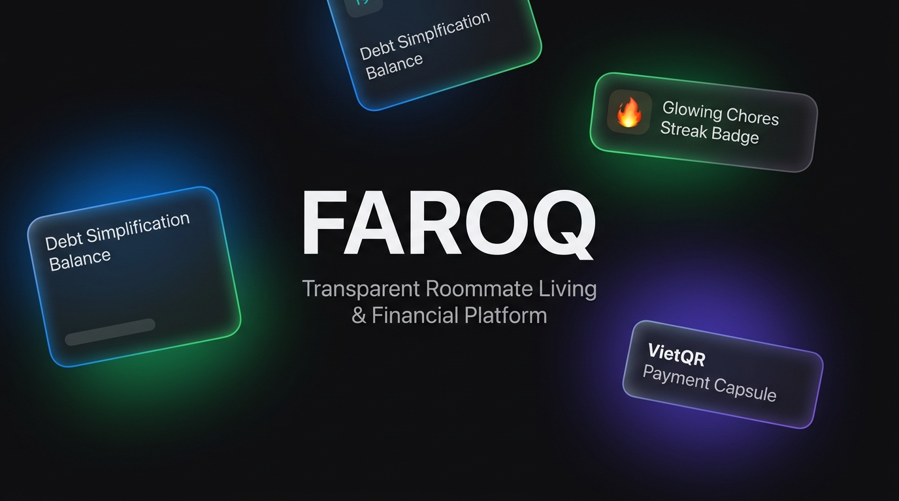
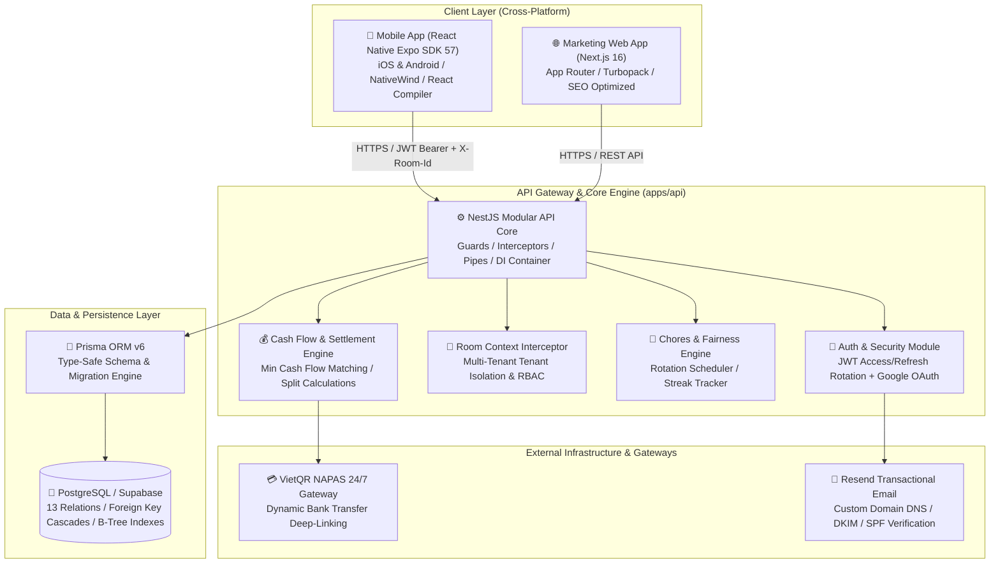

# Faroq — Transparent Roommate Living & Financial Platform

<div align="center">




**An enterprise-grade fullstack platform engineered to eliminate financial friction, optimize complex peer debts, and maintain chore accountability in shared living spaces.**

[System Architecture](#-system-architecture) • [Engineering Innovations](#-key-engineering-innovations) • [Documentation Index](#-architecture--specifications-index) • [Market Benchmark](#-market-benchmark-why-faroq-wins) • [Design System](#-apple-hig-dark-mode-design-system) • [Tech Stack](#-technical-specifications)

</div>

---

> 🔒 **Proprietary Notice**: This public repository serves as the **Architecture, System Design, and Engineering Showcase** for **Faroq**.  
> The core production source code is privately held in preparation for commercial release on the **Apple App Store** and **Google Play Store**.

---

## 🌟 Executive Summary

**Faroq** (*Fa*ir + *Ro*om + *Q*uang) was architected to solve the two most contentious friction points of co-living and roommate arrangements:
1. **Financial Ambiguity & Inconvenient Settlements**: Complicated multi-party bill splitting (rent, utilities, grocery runs), awkward debt follow-ups, and convoluted cross-debts ($A \to B \to C$).
2. **Chores Friction & Accountability Deficits**: Invisible labor, neglected cleaning duties, and unbalanced work distribution leading to unspoken housemate resentment.

Faroq addresses these challenges through **Graph-Theoretic Cash Flow Simplification**, an **Effort-Weighted Chores Fairness Engine**, and an **OLED Dark Mode experience crafted to Apple Human Interface Guidelines (HIG)**.

---

## 📚 Architecture & Specifications Index

Every subsystem of Faroq is fully documented with production-grade engineering specifications. Explore the deep-dive architectural documents below:

| Engineering Domain | Deep Dive Document | Technical Highlights |
| :--- | :--- | :--- |
| **Database Architecture** | [📐 Database Schema & ERD](docs/architecture/DATABASE_ERD.md) | Visual Mermaid ERD, 13 Prisma models, 3NF normalization, index optimization. |
| **Identity & Security** | [🔐 Authentication & Session Security](docs/architecture/AUTHENTICATION.md) | Dual-token JWT architecture (15m Access / 30d Refresh), Token Rotation, RBAC. |
| **Multi-Tenancy** | [🏢 Room Context Architecture](docs/architecture/ROOM_CONTEXT_ARCHITECTURE.md) | Dynamic tenant isolation, `X-Room-Id` header routing, state cache switching. |
| **Banking & Payments** | [💳 VietQR / NAPAS 24/7 Flow Spec](docs/product/specs/VIETQR_PAYMENT_FLOW_SPEC.md) | Zero-fee direct bank transfers, dynamic QR code payload generation. |
| **Chores Engine** | [🧽 Chores Gamification & Rotation](docs/product/specs/CHORE_GAMIFICATION_SPEC.md) | Effort points (5–25 pts), Streak flame mechanics, Away-Period skip algorithm. |
| **Fairness Metrics** | [⚖️ Fairness Score & Analytics](docs/product/specs/FAIRNESS_AND_ANALYTICS_SPEC.md) | Quantitative mathematical model measuring chore effort vs. financial contribution. |
| **Room Onboarding** | [🔗 Room Invite & Join Protocol](docs/product/specs/ROOM_INVITE_AND_JOIN_SPEC.md) | Universal Deep Links, 6-character shortcode, and QR Code onboarding. |
| **Competitive Analysis** | [📊 Splitwise Benchmark & Research](docs/product/research/SPLITWISE_BENCHMARK.md) | Comprehensive feature comparison vs. Splitwise, Tricount, and local e-wallets. |
| **UI / UX Standards** | [🎨 iOS Dark Theme Design System](docs/design/IOS_DARK_DESIGN_SYSTEM.md) | Apple HIG color tokens, Inset Grouped containers, tactile Haptic feedback. |
| **User Experience** | [🎬 User Journey & Demo Walkthrough](docs/product/USER_JOURNEY_AND_DEMO.md) | 5 end-to-end user flows prepared for technical evaluators and recruiters. |

---

## 🏗️ System Architecture

Faroq is organized as a high-performance **Monorepo (`pnpm workspace`)** enforcing strict separation of concerns:



---

## 💡 Key Engineering Innovations

### 1. Minimum Cash Flow Debt Simplification Algorithm
- **The Problem**: In a four-person apartment, normal daily expenses across grocery runs, electricity, water, and dining out create an unmanageable web of 6 to 8 bilateral debts ($A \to B, B \to C, C \to A$).
- **The Solution**: Faroq executes a **Greedy Net Balance Matching Algorithm**:
  $$\sum_{i=1}^{N} \text{Net Balance}_i = 0$$
  The algorithm collapses transitive debt chains ($A \to B \to C \implies A \to C$), reducing 8 tangled transactions down to a **maximum of 2 or 3 direct settlements**, clearing the entire room's debt with minimal friction.

### 2. The Anti-Splitwise Protocol (Pre-Claim Debt Transparency)
- **Vulnerability in Legacy Apps**: In apps like Splitwise, any group member can arbitrarily add an email and silently assign debt to that user without consent.
- **Faroq's Defensive Engineering**:
  - **Pre-Claim Debt Statement**: When an invited roommate joins to claim a virtual placeholder member, the system displays an immutable pre-claim balance sheet detailing every pending receivable and payable.
  - **Explicit Consent Gate**: The user must explicitly approve the ledger via *"Accept Liability"*. If declined, the placeholder remains detached with zero liability transferred.
  - **Safe Leave Guard**: The backend strictly blocks member departure if their net balance $\neq 0$.

### 3. Effort-Weighted Chores Engine & Away-Period Handling
- Tasks are categorized by verified physical burden (**Effort Points**):
  - **5 pts** (Low: Take out trash, water plants)
  - **10 pts** (Medium: Dishwashing, sweeping)
  - **15 pts** (Heavy: Mopping, laundry folding)
  - **25 pts** (Intensive: Toilet sanitation, deep kitchen cleaning)
- **Away-Period Skip Algorithm**: When a resident reports a temporary absence (e.g., visiting family, business trip), the scheduler automatically skips their duty, reassigning it fairly to the next member in sequence.
- **Peer Handshake Mechanics**: Bi-directional acceptance flows for **Cover Requests** (doing someone's chore for extra points) and **Swap Requests** (duty exchange).

### 4. Zero-Fee VietQR NAPAS 24/7 Payment Integration
- Automatically constructs payment QR payloads adhering to the National NAPAS 24/7 standard:
  ```
  https://img.vietqr.io/image/<BANK_BIN>-<ACCOUNT_NUMBER>-compact2.png?amount=<AMOUNT>&addInfo=Faroq%20<ROOM_CODE>
  ```
- Payers simply scan the QR code using their banking app of choice (Vietcombank, MB, Techcombank, VPBank, etc.). The exact amount, recipient account, and reference code pre-populate with 0% gateway commission fees.

---

## 📊 Market Benchmark: Why Faroq Wins

| Feature / Metric | Splitwise | Tricount | MoMo / ZaloPay Split | 🏆 **Faroq** |
| :--- | :---: | :---: | :---: | :---: |
| **Expense Splitting** (Equal, Exact, %, Shares) | Yes (Paid Pro tier) | Basic | Equal only | **Full & 100% Free** |
| **Unsolicited Debt Protection** | ❌ None | ❌ None | ❌ None | ✅ **Pre-Claim Statement Gate** |
| **Chores & Housekeeping Rotation** | ❌ Not available | ❌ Not available | ❌ Not available | ✅ **Effort Points & Away Skip** |
| **Direct Banking Integration** | ❌ None (Manual) | ❌ None | Closed-wallet only | ✅ **VietQR NAPAS 24/7 (All Banks)** |
| **Design Aesthetics** | Utility / Cluttered | Legacy UI | Heavy in-app ads | ✅ **Apple HIG OLED Dark Theme** |
| **Offline-First & Haptic Feedback** | ❌ None | ❌ None | ❌ None | ✅ **`expo-haptics` tactile UX** |

---

## 🎨 Apple HIG Dark Mode Design System

Designed to mirror the elegance of tier-1 iOS apps (*Apple Health, Fitness, Amy*):

```
Token                  Hex Value               Application
-----------------------------------------------------------------------------------------
bg-canvas              #121214                 Deep OLED Dark screen background
bg-card                #1c1c1e                 Inset Grouped card container (18px corner radius)
bg-pill                #2c2c2e                 Capsule filter badges & pill buttons (9999px)
border-subtle          rgba(255,255,255,0.08)  Refined card perimeter stroke
accent-blue            #0a84ff                 iOS primary active tint (Action buttons, links)
accent-green           #30d158                 Success status, paid settlements, completed chores
accent-orange          #ff9f0a                 Pending status, Streak flame badge 🔥
accent-red             #ff453a                 Overdue chores, danger alerts, destructive actions
accent-purple          #5e5ce6                 Fairness metrics, analytics cards, VIP badges
```

- **Haptic Feedback**: Contextual tactile pulses triggered via `expo-haptics` on chore completions, payment confirmations, and modal dismissals.
- **Safe Area Insets**: Dynamic calculations ensuring flawless padding across iPhone Dynamic Island, camera notches, and Android navigation bars.

---

## 🛠️ Technical Specifications

```
Layer                   Technology & Libraries
-----------------------------------------------------------------------------------------
Mobile Runtime          React Native 0.76+, Expo SDK 57 (New Architecture enabled)
Mobile Architecture     Expo Router v4 (File-based navigation), React Compiler
Mobile Styling          NativeWind v4 (TailwindCSS) + Apple HIG Dark Theme Tokens
Web Application         Next.js 16 (App Router, Turbopack, React 19, Server Components)
Backend Framework       NestJS 11 (Modular Architecture, Dependency Injection, Pipes, Guards)
Backend Language        TypeScript 5.x (Strict Type Checking enabled)
Database & ORM          PostgreSQL 16 (Hosted on Supabase), Prisma ORM v6
Authentication          Dual JWT (15-min Access Token + 30-day Rotating Refresh Token), Google OAuth
Email Infrastructure    Resend API (DKIM, SPF, DMARC custom DNS verified)
Payment Gateway         VietQR / NAPAS 24/7 Dynamic QR Code Generation Engine
Testing & Tooling       Vitest, Supertest, React Native Testing Library, Oxlint, Prettier
```

---

## 👨‍💻 Author & Engineering Contact

**Trần Văn Quang (tvquang0511)**  
- **Role**: Creator & Fullstack Engineer (Mobile & Backend)
- **GitHub**: [@tvquang0511](https://github.com/tvquang0511)
- **Repository Showcase**: [github.com/tvquang0511/Faroq](https://github.com/tvquang0511/Faroq)
- **Email**: `tvquang0511@gmail.com`
- **Location**: Ho Chi Minh City, Vietnam

---

<div align="center">
  <sub>© 2026 Faroq. Engineered with passion for fair, transparent, and civilized shared living spaces.</sub>
</div>
