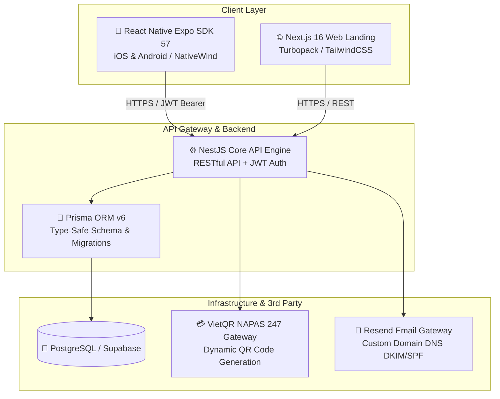

# Faroq — Transparent Roommate Living & Financial Platform

<div align="center">


**Giải pháp công nghệ toàn diện cho bài toán quản lý chi tiêu, công nợ tối ưu và phân chia việc nhà công bằng trong phòng trọ sinh viên & người đi làm trẻ.**

[System Architecture](#-system-architecture--design) • [Key Engineering Innovations](#-key-engineering-innovations) • [Market Benchmark (vs Splitwise)](#-market-benchmark-why-faroq-wins) • [Design System](#-apple-hig-dark-mode-design-system) • [API & Documentation](#-api-specification--docs)

</div>

---

> 🔒 **Proprietary Notice**: This public repository serves as the **Architecture, System Design & Technical Portfolio** of **Faroq**.  
> The core source code is maintained in a private repository in preparation for commercial deployment to the **Apple App Store** and **Google Play Store**.

---

## 🌟 Executive Summary

**Faroq** (*Fa*ir + *Ro*om + *Q*uang) được thiết kế và xây dựng để giải quyết triệt để 2 "nỗi đau" nhức nhối nhất trong cuộc sống sống chung phòng trọ tại Việt Nam:
1. **Sự ngại ngùng và mập mờ về tài chính**: Chia tiền điện nước phức tạp, tính toán nợ chéo rắc rối (A nợ B, B nợ C), ngại mở lời đòi tiền.
2. **Xung đột việc nhà (Chores Conflict)**: Người làm nhiều, người lười biếng, lịch trực nhật bị lãng quên hoặc không minh bạch.

Faroq kết hợp **thuật toán tối ưu luồng tiền (Minimum Cash Flow Debt Simplification)**, **hệ thống tính điểm công bằng việc nhà (Fairness Score & Effort Points)**, cùng chuẩn giao diện **Apple Human Interface Guidelines (HIG) Dark Theme cao cấp**.

---

## 🏗️ System Architecture & Design

Hệ thống được tổ chức theo cấu trúc **Enterprise Monorepo (`pnpm workspace`)**:



### Monorepo Architecture Overview
- **`apps/mobile`**: Ứng dụng di động đa nền tảng React Native (Expo SDK 57, Expo Router v4, React Compiler, NativeWind, Safe Area Insets, Expo Haptics).
- **`apps/api`**: Backend kiến trúc Module hóa NestJS (Dependency Injection, Guards, Interceptors, Pipes, Prisma Client).
- **`apps/web`**: Web landing page giới thiệu sản phẩm Next.js 16 với hỗ trợ SEO và responsive tối ưu.

---

## 💡 Key Engineering Innovations

### 1. Thuật Toán Tối Thiểu Hóa Số Giao Dịch Trả Nợ (Debt Simplification Algorithm)
- **Vấn đề**: Trong phòng 4 người, sau 1 tháng chi tiêu chung, thường phát sinh 6-8 khoản nợ lòng vòng đan xen nhau.
- **Giải pháp của Faroq**: Áp dụng thuật toán đồ thị cân bằng số dư (Greedy Net Balance Matching):
  $$\sum \text{Net Balance} = 0$$
  Thuật toán tự động triệt tiêu các khoản nợ bắc cầu ($A \to B \to C \implies A \to C$), giảm thiểu từ 6-8 giao dịch xuống **tối đa chỉ 2-3 giao dịch là sạch nợ toàn bộ phòng**.

### 2. Cơ Chế Mời Thụ Động & Chống Bẫy Nợ Ảo (Anti-Splitwise Debt Trap)
- **Điểm yếu của Splitwise**: Bất kỳ ai cũng có thể thêm email của bạn vào nhóm và tự ý gán nợ lên tài khoản của bạn mà bạn không hề hay biết hay đồng ý.
- **Giải pháp độc quyền của Faroq**:
  - **Pre-claim Debt Statement**: Khi được mời vào phòng để tiếp quản một hồ sơ thành viên ảo cũ, hệ thống bắt buộc hiển thị **bảng kê khai công nợ chi tiết** (Ai đang nợ mình bao nhiêu, mình đang nợ ai bao nhiêu).
  - Người được mời phải chủ động bấm **"Tôi xác nhận tiếp quản nợ"** thì giao dịch mới được liên kết. Nếu từ chối, hồ sơ ảo được hoàn trả nguyên trạng mà không phát sinh tranh chấp.
  - **Safe Leave Guard**: Chặn tuyệt đối hành vi rời phòng khi thành viên vẫn còn nợ chưa thanh toán.

### 3. Động Cơ Xoay Vòng Việc Nhà & Đo Điểm Công Bằng (Chores Fairness Engine)
- Phân loại công việc theo thang điểm công sức (**Effort Points**): 5đ (Đổ rác), 10đ (Rửa bát), 15đ (Lau sàn), 25đ (Tổng vệ sinh).
- Thuật toán xoay tua ca trực tự động nhận diện **Kỳ Vắng Mặt (Away Periods)**: Khi một bạn về quê hoặc đi công tác, thuật toán tự động nhảy cóc (skip) ca trực sang thành viên tiếp theo một cách công bằng.
- Hỗ trợ luồng **Nhờ làm hộ (Cover Request)** và **Đổi ca (Swap Request)** với xác thực 2 chiều.

### 4. Tích Hợp Cổng Thanh Toán VietQR Chuẩn NAPAS 24/7
- Tự động sinh mã QR chuyển khoản ngân hàng chính xác đến từng đồng theo cú pháp chuẩn của Napas:
  ```
  https://img.vietqr.io/image/<BIN>-<STK>-compact2.png?amount=<TIỀN>&addInfo=Faroq%20<ROOM>
  ```
- Người trả nợ chỉ cần quét mã trên bất kỳ ứng dụng ngân hàng nào (Vietcombank, MB, Techcombank, v.v.), không cần gõ tay số tài khoản hay số tiền.

---

## 📊 Market Benchmark: Why Faroq Wins?

| Tiêu chí | Splitwise | Tricount | ZaloPay / MoMo Chia Tiền | 🏆 **Faroq** |
| :--- | :---: | :---: | :---: | :---: |
| **Chia tiền theo 4 phương thức** (Equal, Exact, %, Shares) | Có (bản Pro trả phí) | Cơ bản | Chỉ chia đều | **Toàn diện & Miễn phí** |
| **Bảo vệ chống bị gán nợ oan** | ❌ Không có | ❌ Không có | ❌ Không có | ✅ **Bảng kê khai Pre-claim** |
| **Quản lý lịch làm việc nhà** | ❌ Không có | ❌ Không có | ❌ Không có | ✅ **Xoay tua & Điểm công sức** |
| **Tích hợp VietQR ngân hàng VN** | ❌ Không có | ❌ Không có | Chỉ trong ví đóng | ✅ **Tất cả ngân hàng VN** |
| **Giao diện Apple Dark Mode** | Bình thường | Cũ kỹ | Phức tạp, nhiều quảng cáo | ✅ **Apple HIG Dark Theme** |

---

## 🎨 Apple HIG Dark Mode Design System

Giao diện Faroq được lấy cảm hứng từ các ứng dụng cao cấp hàng đầu của hệ sinh thái Apple (*Apple Health, Fitness, Amy*):

```
Token                  Mã Màu HEX      Ứng dụng
-------------------------------------------------------------------------
bg-canvas              #121214         Nền OLED Dark sang trọng
bg-card                #1c1c1e         Thẻ Inset Grouped bo cong 18px
bg-pill                #2c2c2e         Nút lọc viên thuốc (borderRadius 9999px)
border-subtle          rgba(255,255,255,0.08)  Viền mảnh tinh tế
accent-blue            #0a84ff         Màu chủ đạo iOS (Action button, Link)
accent-green           #30d158         Đã xong việc, đã thanh toán
accent-orange          #ff9f0a         Việc đang chờ, Streak chuỗi lửa 🔥
accent-red             #ff453a         Quá hạn, cảnh báo an toàn rời phòng
accent-purple          #5e5ce6         Điểm công bằng, thống kê
```

- **Haptic Feedback**: Tích hợp rung phản hồi xúc giác tinh tế qua `expo-haptics` khi hoàn thành việc nhà hoặc thanh toán.
- **Safe Area Insets**: Xử lý mượt mà tai thỏ Dynamic Island và phím Home Bar trên tất cả các dòng thiết bị iOS & Android.

---

## 📑 API Specification & Docs

Toàn bộ hệ thống API backend của Faroq được thiết kế theo chuẩn RESTful cấp độ cao với:
- **14 Domain Modules**: `Auth`, `Users`, `Rooms`, `Invitations`, `Expenses`, `Incomes`, `Settlements`, `Categories`, `Expense Presets`, `Chores - Core`, `Chores - Completions`, `Chores - Requests`, `Chores - Away Periods`, `Health`.
- **46 Endpoints** được đặc tả đầy đủ Request DTO, Validation Rules, Response Codes, JWT Bearer Protection.
- **Swagger / OpenAPI 3.0**: Trực quan hóa và kiểm thử trực tiếp qua Swagger UI.
- **TypeDoc Engine**: Tự động sinh tài liệu kiến trúc mã nguồn từ TypeScript AST Compiler.

---

## 🛠️ Tech Stack Matrix

```
Layer                   Technology
-------------------------------------------------------------------------
Frontend Framework      React Native (Expo SDK 57), React 19, Expo Router v4
Styling                 NativeWind (TailwindCSS) + Apple HIG Dark Tokens
Web Landing             Next.js 16 (App Router, Turbopack, React 19)
Backend Runtime         Node.js 22 LTS, NestJS 12
Language                TypeScript 5.x (Strict Type Checking)
Database & ORM          PostgreSQL 16, Prisma ORM 6
Authentication          JWT (Access Token 15m + Refresh Token Rotation 30d), Google OAuth
Email Infrastructure    Resend API (DKIM / SPF verified domain)
Payment Gateway         VietQR / NAPAS 247 Dynamic QR
Testing                 Vitest, Supertest, React Native Testing Library
Linter & Formatter      Oxlint, Prettier
```

---

## 👨‍💻 Author & Contact

**Trần Văn Quang (tvquang0511)**  
- **Role**: Fullstack Mobile & Backend Engineer (Creator of Faroq)
- **GitHub**: [@tvquang0511](https://github.com/tvquang0511)
- **Email**: `tvquang0511@gmail.com`
- **Location**: Ho Chi Minh City, Vietnam

---

<div align="center">
  <sub>© 2026 Faroq. Engineered with passion for fair, transparent and civilized shared living.</sub>
</div>
