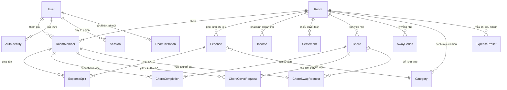

# Faroq — Mô Hình Thực Thể Cơ Sở Dữ Liệu (Database ERD Schema)

> **Tài liệu đặc tả kiến trúc dữ liệu PostgreSQL / Prisma ORM của Faroq.**  
> Hệ thống được thiết kế chuẩn hóa (3NF) nhằm đảm bảo tính toàn vẹn dữ liệu tài chính, hiệu năng truy vấn cao và khả năng mở rộng linh hoạt.

---

## 1. Sơ Đồ Thực Thể Quan Hệ Tổng Quan (Mermaid ERD)

---

## 2. Chi Tiết Các Cụm Thực Thể Chính (Core Entity Clusters)

### A. Phân Hệ Người Dùng & Phòng Trọ (Users & Rooms Domain)
- **`User`**: Lưu trữ danh tính người dùng, trạng thái kích hoạt email, cấu hình thông tin ngân hàng thụ hưởng (VietQR Napas 24/7) và phòng chính (`primaryRoomId`).
- **`Room`**: Đại diện cho một phòng trọ hoặc căn hộ chung. Quản lý ngày chốt hóa đơn (`billingCycleStartDay`).
- **`RoomMember`**: Bảng cầu nối xác định vai trò (`OWNER`, `ADMIN`, `MEMBER`) của người dùng trong phòng. Đặc biệt hỗ trợ **Thành viên ảo (Guest/Shadow Member)** bằng cách cho phép `userId` có thể nhận giá trị `NULL`.

### B. Phân Hệ Tài Chính & Quyết Toán (Expenses & Settlements Domain)
- **`Expense`**: Giao dịch chi tiêu chung của phòng. Lưu trữ số tiền (`amount`), người thanh toán trước (`payerId`) và phương thức chia nợ (`SplitMethod`):
  - `EQUAL`: Chia đều theo số lượng thành viên.
  - `EXACT`: Chỉ định chính xác số tiền từng người phải trả.
  - `PERCENTAGE`: Chia theo phần trăm đóng góp.
  - `SHARES`: Chia theo tỷ lệ phần chia (Ví dụ: người dùng phòng lớn trả 2 phần, phòng nhỏ trả 1 phần).
- **`ExpenseSplit`**: Chi tiết phân bổ nợ cho từng `RoomMember`. Đảm bảo tổng tiền chia luôn khớp 100% với tổng chi tiêu gốc.
- **`Settlement`**: Ghi nhận giao dịch trả nợ thực tế giữa người nợ (`payerId`) và người thu nợ (`receiverId`).

### C. Phân Hệ Quản Lý Việc Nhà (Chores & Fairness Engine)
- **`Chore`**: Định nghĩa công việc nhà với tần suất thực hiện (`DAILY`, `WEEKLY`, `CUSTOM_WEEKDAYS`, `INTERVAL`) và thang điểm công sức (`effortPoints: 5 - 25đ`).
- **`ChoreCompletion`**: Ghi nhận lịch sử check-in hoàn thành công việc theo từng ngày cụ thể (`scheduledDate` được chuẩn hóa về `00:00:00.000Z`).
- **`ChoreCoverRequest` / `ChoreSwapRequest`**: Quản lý quy trình trao đổi ca trực nhật giữa các bạn cùng phòng (Nhờ làm thay / Đổi ca qua lại) có xác nhận 2 chiều.
- **`AwayPeriod`**: Lưu trữ khoảng thời gian thành viên báo vắng nhà (về quê, du lịch). Thuật toán phân công xoay vòng tự động bỏ qua các thành viên đang trong thời gian này.

### D. Phân Hệ Mời Thành Viên An Toàn (In-App Invitations)
- **`RoomInvitation`**: Quản lý lời mời tham gia phòng qua Email. Có trường `claimMemberId` hỗ trợ luồng **tiếp quản hồ sơ ảo minh bạch**, bắt buộc người được mời duyệt bảng kê nợ (Pre-claim Debt Statement) trước khi gia nhập.

---

## 3. Quy Chuẩn Kỹ Thuật Dữ Liệu (Integrity & Constraints)
1. **Số tiền nguyên tệ (VND)**: Tất cả các trường tiền tệ (`amount`, `splitAmounts`) được lưu trữ dưới dạng số nguyên (`Int`), nói không với số thực (`Float`) để triệt tiêu hoàn toàn sai số làm tròn (Floating-point precision issues).
2. **Chuẩn hóa ngày giờ (UTC+0)**: Mọi mốc thời gian phân ca trực được chuẩn hóa tại đầu ngày UTC (`00:00:00.000Z`) để tránh lệch ngày do chênh lệch múi giờ giữa máy chủ và thiết bị di động.
3. **Quan hệ khóa ngoại an toàn**: Áp dụng các chính sách `onDelete: Cascade` hoặc `onDelete: SetNull` hợp lý, nghiêm cấm việc xóa vật lý các bản ghi đã hoàn thành quyết toán.
